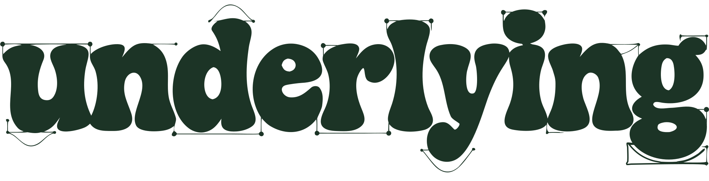

<p align="center">
  <picture>
    <source media="(prefers-color-scheme: dark)" srcset="brand/wordmark-cream.svg" />
    
  </picture>
</p>

<p align="center"><strong>Physics-first motion for the web.</strong></p>

<p align="center">
  Springs and inertia by default. Every value interruptible, with its velocity conserved.
  <br />Accessible out of the box. Zero dependencies. ~9.5 kB gzip.
</p>

<p align="center">
  <a href="https://www.npmjs.com/package/@underlying/core"></a>
  <a href="https://www.npmjs.com/package/@underlying/scroll"></a>
  <a href="https://www.npmjs.com/package/@underlying/timeline"></a>
  <a href="https://www.npmjs.com/package/@underlying/gestures"></a>
  <a href="https://www.npmjs.com/package/@underlying/text"></a>
  <a href="https://www.npmjs.com/package/@underlying/svg"></a>
  <a href="https://underlyi.ng"></a>
  
  
  
</p>

---

Most animation libraries make you describe motion as a duration and a curve. `underlying` starts from physics: you set a target, and a spring, a glide or a decay carries the value there - interruptible at any moment, with momentum preserved. Duration and easing still exist, as an escape hatch, not as the default.

```ts
import { animate } from '@underlying/core'

animate(box, { x: 320, rotate: 12 })   // springs by default
animate(box, { x: 0, rotate: 0 })      // retarget mid-flight: velocity conserved, never a jump
```

## Why physics-first

- **Physical by default.** No hardcoded durations, no cubic-bezier guesswork. Springs, inertia and decay drive the motion; `duration` / `easing` is the escape hatch.
- **Interruptible by design.** Every animated value knows its position *and its velocity*. A second call retargets from exactly where it is, carrying momentum - not a parallel animation, not a restart.
- **Accessible natively.** `prefers-reduced-motion` is respected with zero config (skip or fade), reacts to mid-session OS changes, and supports app-level overrides.
- **Deterministic.** A fixed 1/120 s timestep: the same inputs produce the same trajectory at 60, 120 or 144 Hz.
- **One rAF loop.** Everything batches into a single tick - simulations first, style writes after. Eligible tweens ride the WAAPI compositor and hand control back losslessly on interruption.
- **Any CSS property.** Beyond the five transform/opacity channels: lengths with unit conversion, colors, composite values and keyframe arrays, through a tree-shakeable value-type registry.

## Playback

Springs stay live; tweens are seekable. The opt-in [`@underlying/core/playback`](packages/core) entry adds pause, timeScale, reverse and seek - plus `bake()`, which samples a spring's trajectory into a scrubbable clip, `follow()` for momentum scrub, and `sequence()`, a live composition you interrupt by hand (the twin of the timeline you scrub).

```ts
import { playable, follow, sequence } from '@underlying/core/playback'

const motion = playable(value).spring(300)
motion.pause().timeScale(0.25)   // slow-mo, identical trajectory shape

const lag = follow(0)            // a value that springs toward a moving target
onScroll((y) => lag.target(y))   // momentum scrub, conserved velocity

sequence().spring(a, 1).spring(b, 1, { overlap: 80 }).play()   // live cascade, grab it mid-flight
```

## Packages

Live, interruptible physics is the default - for a single value (core, scroll's momentum scrub), for whole compositions (`sequence()`), and for drag, fling and FLIP layout transitions (`@underlying/gestures`). The layers that let you scrub *time* - scroll's locked scrub, the timeline - record that physics into a seekable form: the motion stays physics-shaped (a real spring trajectory, overshoot and all), never an eased fake. So composition comes in two honest flavors: live and interruptible (`sequence()`), or recorded and scrubbable (the timeline).

| Package | Description | Status |
| --- | --- | --- |
| [`@underlying/core`](packages/core) | Scheduler, animatable values, springs / inertia / decay, any-CSS-property value model, composition, a11y, WAAPI delegation | beta |
| `@underlying/core/playback` | pause / timeScale / reverse / seek, `bake()`, `follow()`, `sequence()` - opt-in, separate bundle | beta |
| `@underlying/angular` | Service, directives, signals integration | planned |
| [`@underlying/scroll`](packages/scroll) | Scrub, parallax, pin, snap, triggers - scroll as a source driving animatables | beta |
| [`@underlying/timeline`](packages/timeline) | Seekable timelines: labels, relative positions, nesting, stagger - scrubbable, physics-shaped | beta |
| [`@underlying/gestures`](packages/gestures) | Drag, fling and interruptible FLIP - pointer velocity into physics, layout transitions that retarget mid-flight | beta |
| [`@underlying/text`](packages/text) | Accessible split (chars / words / lines), physics reveal, scramble, typewriter | beta |
| [`@underlying/svg`](packages/svg) | SVG path animation: ride a path (`motionPath`), draw a stroke on (`draw`), morph one shape into another (`morph`) - physics-first, flick / interrupt / scrub | beta |

## Install

```sh
npm install @underlying/core
```

Every demo on the docs site is live - [read the docs at underlyi.ng](https://underlyi.ng).

## Development

```sh
pnpm install
pnpm test        # Vitest
pnpm typecheck   # strict TypeScript
pnpm build       # ESM + CJS + types
pnpm size        # gzip budget gate
pnpm demo        # interactive docs site
```

## License

MIT © underlyi.ng
